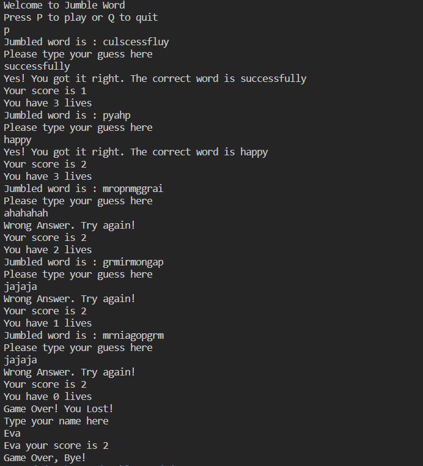

# Jumble Word
This is a very simple project that I created after finishing the Python module at Code Institute. The project is intended for practice only. 
## Features
Jumble word would pick a random word and jumble the letters. The user starts with 3 lives and needs to guess each word. Every time the guess is correct the user's score increments and if the guess is wrong the user loses a life. When the user is out of lives the game ends, the program asks for the user's name and stores their high score in a text file.
## Future Improvements
- I would like to work on the appearance of tha game using libraries. 
- I would like to add database to store the highscores instead of txt file. 
## Images 
